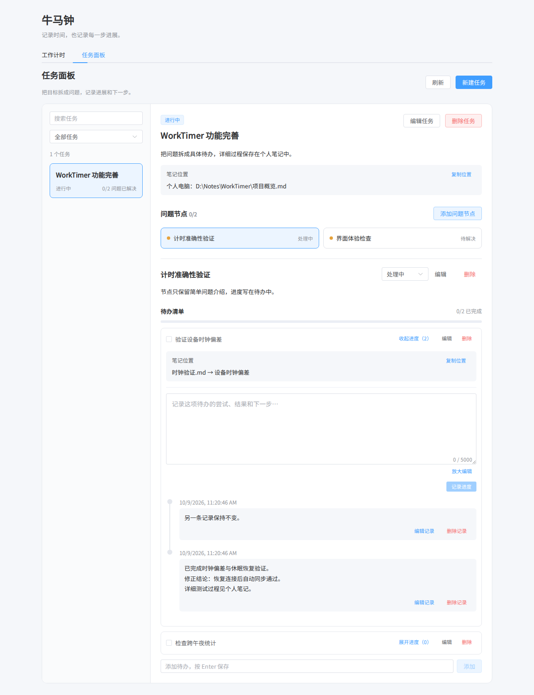

# WorkTimer · 牛马钟

记录工作与摸鱼/学习的时间，也记录任务推进过程中遇到的问题和下一步。浏览器提供操作界面，C++ 服务负责接口和持久化，数据保存在本地 SQLite 文件中。

## 能做什么

| 功能 | 使用方式 |
| --- | --- |
| 工作计时 | 选择“正式工作”或“摸鱼/学习”开始计时；同一服务同时保留一个进行中的计时 |
| 结束时间确认 | 结束前确认实际结束时间，可提前结束并查看保留、扣除的时长 |
| 历史与笔记 | 按日历查看时长、时间分布和明细，为记录添加笔记；跨午夜的记录按天展示 |
| 任务面板 | 创建任务，在任务下建立问题节点，再拆分为可勾选的待办 |
| 待办内进度 | 展开具体待办，记录尝试、结果和下一步；支持编辑已有记录，完成后保留日志 |
| 笔记位置 | 为任务和待办填写本地路径或文字线索，便于自己和他人查找；支持复制 |
| 长文本阅读与编辑 | 说明、计时笔记和进度可展开全文；输入框自动增高，并可放大编辑 |
| 多端访问 | 多个浏览器连接同一服务，共享已保存数据，通过定期请求同步 |

任务可以表示“复现实验”，节点可以表示“准确率偏低”，待办可以表示“检查输入归一化”，进度则记录这一步做过什么、结果如何。详细操作见[使用指南](docs/usage.md)。

当前计时记录与任务面板独立，尚未关联任务工时。服务没有账号与用户隔离，连接同一服务的设备共享数据。

<details>
<summary>查看任务面板示例（演示数据）</summary>



</details>

## 快速开始

以下命令用于 Linux 或 Windows 的 WSL 环境。当前 Makefile 使用 POSIX 工具，不能直接当作 PowerShell 或 cmd 脚本运行；WSL 中生成的是 Linux 可执行文件。

### 准备依赖

需要支持 C++17 的编译器、CMake 3.20+、GNU Make、SQLite3 和独立版 Asio 开发头文件，以及 Node.js 20+ 与 npm。Crow 头文件已包含在仓库中。

Ubuntu/Debian 的系统依赖：

```bash
sudo apt update
sudo apt install -y build-essential cmake libsqlite3-dev libasio-dev
```

确认版本，尤其是系统包提供的 CMake 和 Node.js 是否满足要求：

```bash
g++ --version
cmake --version
node --version
npm --version
```

旧版 CentOS 等系统的默认工具链可能不足，不能只安装 `sqlite-devel`、`asio-devel` 就认为依赖齐全。请同时检查编译器、CMake 和 Node.js 版本。

### 构建并运行

```bash
git clone https://github.com/ttttwwww/work_timer.git
cd work_timer
# 按锁文件安装前端依赖
npm --prefix frontend ci
make release
cd build-Release
./WorkTimer
```

打开 [http://localhost:8080](http://localhost:8080)。运行时保持终端中的服务进程开启。

`make release` 构建 Vue 静态资源和 C++ 程序，再组装到 `build-Release/`。请从该目录运行程序，因为配置文件和静态资源使用相对路径。更多构建与运行原理见[系统架构](docs/architecture.md)。

## 配置与数据

配置源文件是 [backend/config.json](backend/config.json)，构建时复制到 `build-Release/config.json`：

```json
{
  "port": 8080,
  "bind_address": "127.0.0.1",
  "database_path": "../data/worktimer.db"
}
```

| 配置 | 含义 |
| --- | --- |
| `port` | HTTP 监听端口 |
| `bind_address` | 默认仅监听本机；多端访问时改为服务器可达的接口地址，或按需监听 `0.0.0.0` |
| `database_path` | SQLite 文件路径；相对路径以程序启动时的工作目录为基准 |

配置解析器按行读取，保留上述多行格式，每个字段单独一行。修改后重启服务生效。重新构建会覆盖发布目录中的配置，因此需要长期保留的配置应修改源文件，或在部署时重新应用。

默认数据位于项目根目录的 `data/worktimer.db`。升级源码时保留该文件及原配置路径，启动时会自动创建新表并迁移旧数据，详见[数据库与迁移](docs/database.md)。对同一数据库继续运行新版本，才能看到旧记录。

多端访问时在其他设备打开服务器的实际地址与端口。浏览器中的 `localhost` 指的是该浏览器所在设备；服务当前没有登录鉴权，应部署在你打算共享数据的可信网络中。

## 文档导航

| 想了解什么 | 文档 |
| --- | --- |
| 功能、操作步骤和保存规则 | [使用指南](docs/usage.md) |
| 运行结构、模块职责与代码位置 | [系统架构](docs/architecture.md) |
| 从界面操作追踪到数据库的完整过程 | [数据流与实现解读](docs/data-flow.md) |
| 表关系、字段、约束与升级迁移 | [数据库说明](docs/database.md) |
| HTTP 请求、响应、错误与数据库映射 | [API 参考](docs/api.md) |

学习实现时建议按“系统架构 → 数据流 → 数据库/API 参考”的顺序阅读。

## 开发与验证

| 命令 | 作用 |
| --- | --- |
| `make` / `make debug` | Debug 构建，组装到 `build-Debug/` |
| `make release` | Release 构建，组装到 `build-Release/` |
| `make clean` | 清除后端构建缓存、前端产物和构建标记，保留数据与 npm 依赖；当前脚本不会删除根目录的 `build-*` 发布目录 |
| `make distclean` | 在 `clean` 基础上移除前端 `node_modules/` |

前端开发可在后端运行时执行 `npm --prefix frontend run dev`，使用 Vite 输出的地址。开发代理将 `/api` 转发到 `http://localhost:8080`；更改后端端口后需要同步修改 [frontend/vite.config.js](frontend/vite.config.js)。

从项目根目录执行测试：

```bash
npm --prefix frontend test
npm --prefix frontend run build
# 先通过 make release 生成后端程序
python3 tests/test_api.py ./build-Release/WorkTimer
```

HTTP 测试在临时目录中启动独立服务和数据库，覆盖计时校验、并发开始、数据迁移、任务 CRUD、持久化与级联删除，不使用个人数据库。前端测试覆盖时钟与按日统计逻辑。Vite 生产构建可能提示 Element Plus 全量引入的包体积较大。

## 常见问题

- **WSL 报 `target pattern contains no '%'`**：确认使用新版 Makefile。它会在扫描依赖时忽略 Windows 下载生成的 `:Zone.Identifier` 文件；其他含冒号或空格的源码路径仍可能影响 Make 的依赖解析。
- **缺少 `asio.hpp` 或 SQLite 头文件**：安装开发包，而不只是 SQLite 命令行程序。
- **页面提示找不到 `dist/index.html`**：先执行 `make release`，再进入 `build-Release/` 运行。
- **升级后看不到旧数据**：检查运行目录和 `database_path` 是否仍指向原文件；不同路径会创建不同的数据库。
