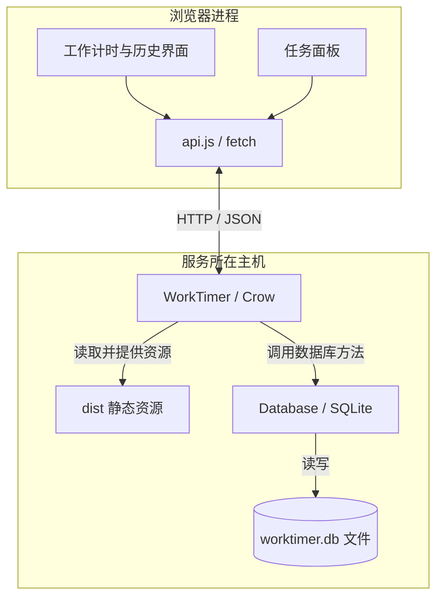
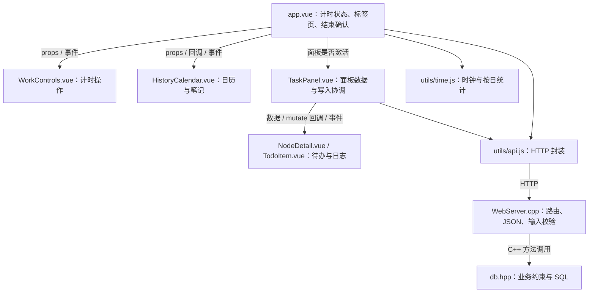
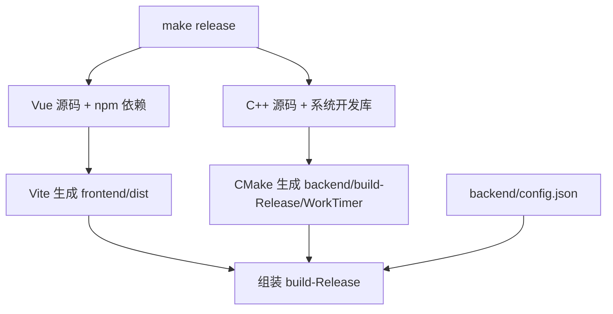

# 系统架构

[返回 README](../README.md) · [使用指南](usage.md) · [数据流](data-flow.md) · [数据库](database.md) · [API](api.md)

本文先介绍运行中的系统，再定位到源码，最后解释构建和启动。图中名称对应实际实现；关键操作的逐步调用见[数据流与实现解读](data-flow.md)。

## 1. 运行时：浏览器、服务与数据文件

打开页面后，Vue 代码在哪里执行？数据又由谁保存？

- **浏览器**执行 Vue，保存当前页面的状态和草稿。浏览器不直接访问 SQLite。
- **WorkTimer** 是一个 C++ 进程。Crow 在同一端口提供首页、静态资源和 `/api` 路由；生产运行不需要另启 Node.js 服务。
- **SQLite** 作为库链接到后端，数据存入文件，不是额外运行的数据库服务器。
- 一个服务可以被多个浏览器访问；没有用户隔离。计时记录与任务数据共用数据库文件，但两类业务没有外键关联。

个人设备上的笔记文件在系统之外；数据库只保存用户填写的 `note_location` 文字，浏览器与服务均不访问这些文件。

界面每秒更新计时显示，并定期通过 HTTP 拉取状态；当前没有 WebSocket 推送。关掉页面不会自动结束数据库中的计时记录。

## 2. 模块：沿调用关系定位代码

这里有两种不同边界：Vue 组件之间通过 props、事件或函数回调协作；浏览器与 C++ 进程之间通过 HTTP 交互。图中的 `api.js → WebServer.cpp` 不是跨语言的直接函数调用。

| 文件 | 主要责任与状态 |
| --- | --- |
| [app.vue](../frontend/src/app.vue) | 保存计时记录 `rawWorkLogs` 和服务器时钟估计 `serverNow`；计算活跃会话、日历统计；处理开始、结束、笔记和删除 |
| [WorkControls.vue](../frontend/src/components/WorkControls.vue) | 接收显示数据，发出 `start` / `stop` 事件 |
| [HistoryCalendar.vue](../frontend/src/components/HistoryCalendar.vue) | 按所选日期展示统计、时间条与记录；通过 `saveNote` 回调保存笔记，通过事件请求删除 |
| [TaskPanel.vue](../frontend/src/components/TaskPanel.vue) | 持有面板快照、任务/节点选择、编辑表单与草稿；统一协调 `load` / `mutate` 和轮询 |
| [NodeDetail.vue](../frontend/src/components/NodeDetail.vue) | 节点状态、待办完成比例、新建待办；按 `todo_id` 为各待办分组日志 |
| [TodoItem.vue](../frontend/src/components/TodoItem.vue) | 待办勾选、日志折叠与输入；调用传入的 `mutate` 保存日志 |
| [ExpandableText.vue](../frontend/src/components/ExpandableText.vue) | 测量纯文本预览高度，控制全文展开；不解析富文本 |
| [PlainTextInput.vue](../frontend/src/components/PlainTextInput.vue) | 自动增高输入框与放大编辑窗口，共享父级草稿，不自行提交 |
| [NoteLocation.vue](../frontend/src/components/NoteLocation.vue) / [utils/clipboard.js](../frontend/src/utils/clipboard.js) | 展示笔记位置、复制和手动选择回退；不读取或打开文件 |
| [utils/api.js](../frontend/src/utils/api.js) | 发送请求、解析 JSON、把非成功响应转成异常；不保存业务状态 |
| [utils/time.js](../frontend/src/utils/time.js) | 服务器时钟估计、时长格式化、本地日期转换、跨日拆分统计 |
| [WebServer.cpp](../backend/src/WebServer.cpp) | 注册路由、校验 JSON、调用数据库、生成响应；提供静态资源 |
| [db.hpp](../backend/include/db.hpp) | 数据对象、SQLite 语句封装、表初始化与迁移、读写方法，以及活跃会话、父对象存在等约束 |
| [main.cpp](../backend/main.cpp) / [config.h](../backend/include/config.h) | 读取配置，依次创建 `Database`、`WebServer`，启动监听 |

当前项目没有独立的 Service 层，也没有全局状态管理库。任务面板状态由 `TaskPanel` 持有，计时状态由根组件持有；`WebServer` 和 `Database` 共同承担请求处理与业务约束。文档按这个实际结构解释，未来拆分模块时再同步更新。

## 3. 状态属于哪里

| 状态 | 所在位置 | 生命周期 |
| --- | --- | --- |
| 计时开始/结束、笔记、任务与日志 | SQLite | 服务或页面重启后保留 |
| 当前查询快照、服务器时间锚点 | Vue 组件与时钟对象 | 页面重载后重新请求 |
| 节点下新待办输入、各待办日志草稿与展开状态 | `TaskPanel.drafts` | 当前页面内保留；刷新/关闭后丢失 |
| 请求中标记、选中的日期、编辑弹窗 | 对应组件 | 控制当前交互，不写入数据库 |

前端校验和按钮禁用用于改善交互；后端仍必须校验，因为其他浏览器或自定义客户端也能直接调用 API。保存采用“写入后重新读取”的方式，让界面使用服务器返回的数据。失败和并发边界见[数据流](data-flow.md)。

## 4. 构建时与运行时

| 路径 | 作用 |
| --- | --- |
| `frontend/src/` | 前端源码 |
| `backend/include/`、`backend/src/`、`backend/main.cpp` | 后端头文件、路由实现与入口 |
| `frontend/dist/` | Vite 静态构建产物 |
| `backend/build-Release/` | CMake 缓存、中间文件和后端可执行文件 |
| `build-Release/` | 可运行目录，包含 `WorkTimer`、`dist/`、`config.json` |
| `data/worktimer.db` | 默认配置下的持久化文件，不随源码提交 |
| `docs/`、`tests/`、`frontend/tests/` | 文档、后端 HTTP 测试、前端时钟/统计测试 |

在 `build-Release/` 中运行 `./WorkTimer` 后，启动顺序是：读取当前目录的 `config.json`，打开数据库并初始化/迁移表，注册 HTTP 路由，开始监听。默认相对数据库路径 `../data/worktimer.db` 因此指向项目的 `data/`。

开发时 `npm run dev` 启动 Vite，为前端提供开发服务，并按 [vite.config.js](../frontend/vite.config.js) 把 `/api` 代理到 C++ 后端。这个开发代理不参与生产部署。

## 5. 如何维护这些图

Mermaid 源码与文档一起提交，GitHub 可直接显示。系统图回答“谁和谁通信”，模块图回答“改哪里”，时序图回答“按什么顺序发生”，数据库关系图回答“记录如何归属”。每张图只维护这一类关系，字段和接口细节链接到对应参考文档。

改变组件职责时更新本页；改变请求流程时更新 [data-flow.md](data-flow.md)；改变表或路由时同步更新 [database.md](database.md)、[api.md](api.md)。读者应能从图中的名称定位到上表的实际文件。
