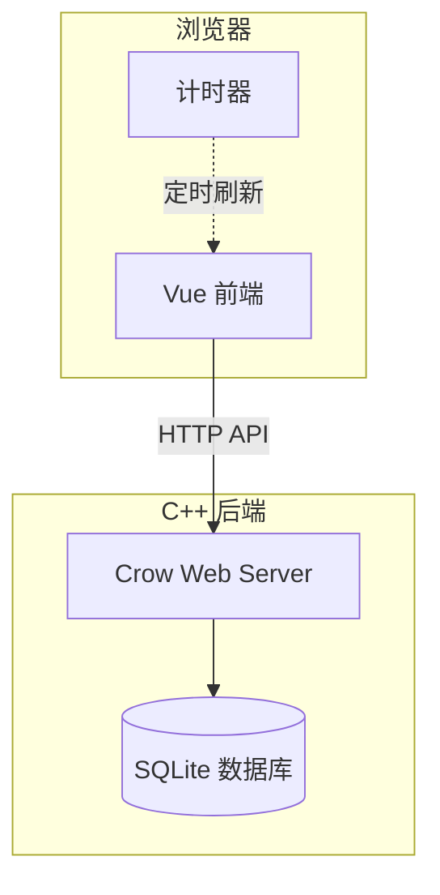

# WorkTimer 架构文档

## 系统架构



## 目录结构

```
worker-counter/
├── backend/           # C++ 后端
│   ├── include/       # 头文件
│   │   ├── config.h   # 配置管理
│   │   ├── db.hpp     # 数据库操作
│   │   └── WebServer.h # Web 服务器
│   ├── src/
│   │   └── WebServer.cpp
│   └── main.cpp       # 入口
├── frontend/          # Vue 前端
│   └── src/
│       ├── app.vue    # 主组件（状态管理）
│       └── components/
│           ├── WorkControls.vue    # 计时器控制
│           └── HistoryCalendar.vue # 历史记录
├── data/              # 数据文件（不会被 clean 删除）
└── release/           # 编译产物
```

## 核心模块

### 前端（Vue）

- **App.vue** - 核心状态管理
  - 管理 `isWorking`, `currentWorkType`, `startTime`
  - 处理计时器逻辑
  - 调用后端 API
  
- **WorkControls.vue** - 计时器 UI
  - 显示计时器
  - 开始/停止按钮
  
- **HistoryCalendar.vue** - 历史记录
  - 日历展示
  - 笔记编辑
  - 记录删除

### 后端（C++）

- **WebServer** - HTTP 服务器
  - 路由处理
  - JSON 序列化
  
- **Database** - 数据库操作
  - CRUD 操作
  - SQLite 封装

## 数据流

详见 [data-flow.md](./data-flow.md)

