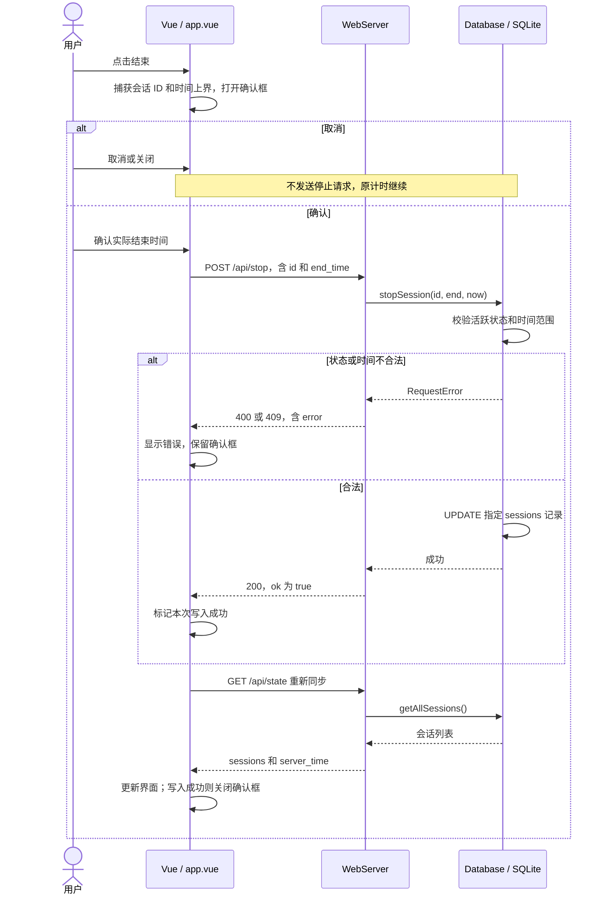
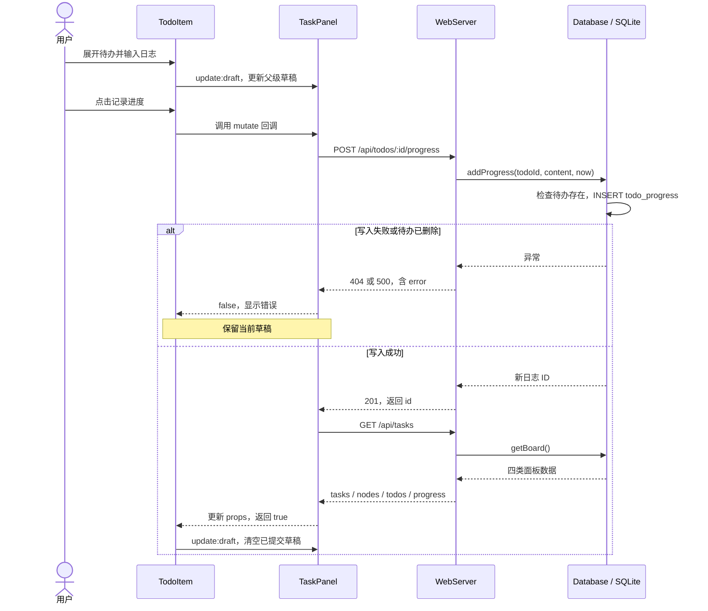

# 数据流与实现解读

[返回 README](../README.md) · [系统架构](architecture.md) · [数据库](database.md) · [API](api.md)

本文以“结束一次计时”和“保存一条待办进度”为主线，把界面、HTTP、C++ 与 SQLite 连起来。代码片段摘取当前实现，字段定义查 [API 参考](api.md)，表约束查[数据库说明](database.md)。

## 1. 先理解组件、请求和持久化的边界

Vue 子组件不需要知道所有数据怎么保存。`WorkControls` 发出 `stop` 事件，根组件负责结束确认；`TodoItem` 调用父级传入的 `mutate` 回调，由 `TaskPanel` 统一控制请求和刷新。

两条业务最终都使用 [utils/api.js](../frontend/src/utils/api.js)：它通过 `fetch` 发出 HTTP 请求，解析 JSON，并在非成功响应时抛出错误。网络另一端的 [WebServer.cpp](../backend/src/WebServer.cpp) 根据路由选择处理函数，校验数据，再调用 [Database](../backend/include/db.hpp)。用户文字通过 SQL 参数绑定写入 SQLite。

组件事件和回调发生在浏览器进程内；HTTP 跨越浏览器与后端的边界；C++ 数据库方法则在后端进程内调用 SQLite 库。区分这三种通信后，便能理解下面的时序。

## 2. 案例一：结束一次计时

前提是已有活跃会话：开始操作发出 `POST /api/start`，数据库以服务器时间插入 `end_time=0` 的记录，返回 `201 {id}`，前端通过 `GET /api/state` 重新读取。再次开始会收到 409。



### 从按钮到请求

在 [WorkControls.vue](../frontend/src/components/WorkControls.vue) 中，结束按钮只发出事件：

```js
const emit = defineEmits(['start', 'stop'])
```

根组件监听该事件，调用 `openStop()`，复制当前会话并保存时间上界。保存会话 ID 的意义是：即使另一设备已结束旧记录、开始新记录，这个旧确认框也只能尝试结束原来的 ID。

[app.vue](../frontend/src/app.vue) 中 `confirmStop()` 传递的请求数据为：

```js
{
  id: stoppingSession.value.id,
  end_time: Math.floor(stopEnd.value / 1000),
}
```

日期输入控件使用浏览器本地时间，JavaScript 内部是毫秒；除以 1000 后才是后端要求的 Unix 秒。界面校验负责及时提示，后端再独立校验，不能依赖前端保证请求正确。

### 从路由到 SQL

`/api/stop` 解析正整数 ID 和可选 `end_time`；不传结束时间时取服务器当前秒。`stopSession()` 先查指定记录是否仍活跃，再检查 `start_time ≤ end_time ≤ now`，最后执行：

```sql
UPDATE sessions SET end_time=?
WHERE id=? AND COALESCE(end_time,0)=0;
```

`?` 是绑定参数的位置，不是字符串拼接。数据库方法抛出的 `RequestError` 携带状态码，路由外围的 `api()` 包装器将它转换成 JSON 错误；其他异常返回 500 的通用错误信息。

### 保存后为什么再读取

前端的 `active` 和 `dailyStats` 都由 `rawWorkLogs` 推导。`syncState()` 把返回的秒级时间戳转成 `Date`，替换响应式记录数组，Vue 的 `computed` 随之重新计算，计时控制区和历史日历一起更新。

写入与随后读取是两个独立请求。`syncState()` 自行捕获读取错误；如果停止写入已成功但同步失败，确认框仍会关闭，页面显示连接错误，恢复同步后才能看到服务器最新状态。

## 3. 案例二：保存一条待办进度



图中省略了路由输入格式失败的 400 分支和网络故障，完整状态见 [API](api.md)。图中的成功路径假设随后的读取也成功；读取失败的边界在下文说明。

### 草稿为何放在父组件

[TaskPanel.vue](../frontend/src/components/TaskPanel.vue) 按节点保存 `drafts`，其中包含新待办输入、按待办 ID 保存的日志草稿以及展开状态。`NodeDetail` 把某条待办的草稿通过 `v-model:draft` 传给 `TodoItem`。

[TodoItem.vue](../frontend/src/components/TodoItem.vue) 用可写计算属性连接输入框和父级：

```js
const progressDraft = computed({
  get: () => props.draft,
  set: (value) => emit('update:draft', value),
})
```

读取时使用父级传来的值，写入时发出更新事件。切换节点会重新显示不同组件，但草稿仍留在 `TaskPanel`，所以返回原节点时还能继续编辑。刷新页面会重新创建组件，内存中的草稿不会保留。

### 保存如何串联

`TodoItem.addProgress()` 去除草稿首尾空白，拒绝空内容和重复请求，再调用：

```js
await props.mutate(`/api/todos/${props.todo.id}/progress`, 'POST', {
  content,
})
```

`mutate` 是从 `TaskPanel` 传来的函数，并不是 `TodoItem` 自己维护的另一套请求状态。它设置 `busy`，使旧的未完成读取失效，写入后调用 `load()` 获取新面板。`TodoItem` 只有得到 `true` 才清空草稿。

后端 `addProgress()` 先确认待办存在，再执行参数化插入：

```sql
INSERT INTO todo_progress(todo_id,content,created_at) VALUES(?,?,?);
```

重新读取时，`getBoard()` 通过 JOIN 附加日志的 `node_id`。`TaskPanel` 先按节点筛选，`NodeDetail` 再按 `todo_id` 分组，各个 `TodoItem` 因而只显示自己的日志。勾选待办只更新 `node_todos.done`，不会改动日志。

### 写入失败和刷新失败有什么区别

写入请求失败时，`mutate()` 返回 `false`，草稿保留。写入已成功但 `load()` 失败时，`load()` 自行显示加载错误，`mutate()` 仍返回 `true`，因此已提交草稿被清空；此时应重新加载，而不是把它当作数据库未保存。网络响应丢失时无法仅凭客户端报错确定有没有写入，当前 API 没有用于追加日志的幂等键。

## 4. 计时显示与多端同步

每秒更新显示不等于每秒写库，也不等于每秒请求后端。时钟实现位于 [utils/time.js](../frontend/src/utils/time.js)：

```js
epoch = serverSeconds * 1000 + Math.max(0, roundTripMs) / 2
anchor = monotonicNow()
```

随后 `now()` 返回服务器时间锚点加上 `performance.now()` 的增量。请求往返耗时的一半只作近似延迟补偿，不是精密网络校时；持久化起止时间仍以服务器为准。前端每秒更新 `serverNow`，活动时长和日历统计随之变化；每 15 秒以及页面重新可见时向服务器校准。

| 场景 | 同步过程 |
| --- | --- |
| 页面初次打开 | 读取 `/api/state`，发现活跃会话后按开始时间恢复显示 |
| 本页面开始/停止 | 写入后立即重新读取状态 |
| 另一设备停止计时 | 本页面下一次轮询或重新可见时发现记录已结束 |
| 任务面板 | 首次挂载读取，面板激活且页面可见、未编辑/保存时每 15 秒读取；再次激活时也刷新 |
| 请求乱序 | 请求版本号丢弃过期读取，避免旧响应覆盖新的页面状态；这不是跨设备数据库版本控制 |

当前同步是轮询，设备之间不是即时推送。断网期间的计时显示是根据已知锚点估算，重新连接后以服务器记录校准。

## 5. 从计时记录到日历统计

`GET /api/state` 返回整条会话，`syncState()` 转为前端对象。`aggregateDays()` 按浏览器本地午夜拆分显示片段；活跃记录以当前估计时间为结束点，已结束记录使用保存的结束时间。每个片段保留原记录 ID，并计算当天片段的时长、起止位置。

例如 23:50 到次日 00:20 的一条会话，分别在两天显示 10 分钟和 20 分钟；数据库不拆成两行。`HistoryCalendar` 根据这些片段绘制时间条，选中日期的明细是响应式计算结果，所以进行中的时间条和时长会随每秒更新一起变化。
