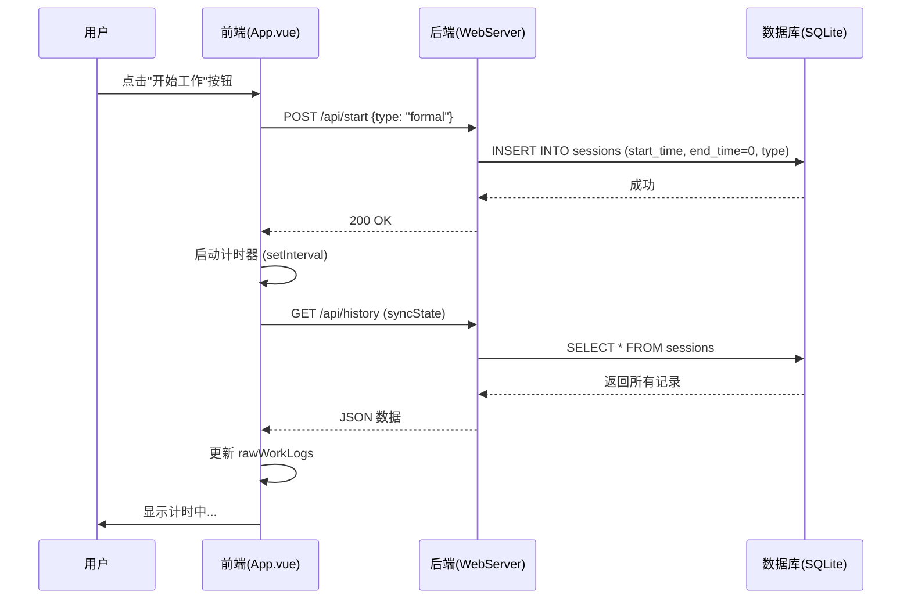
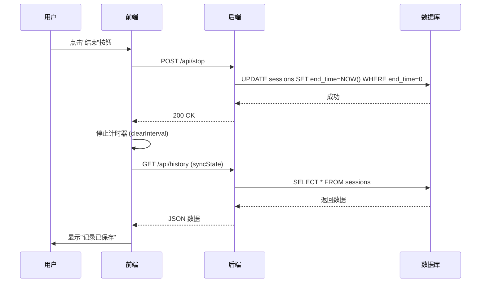
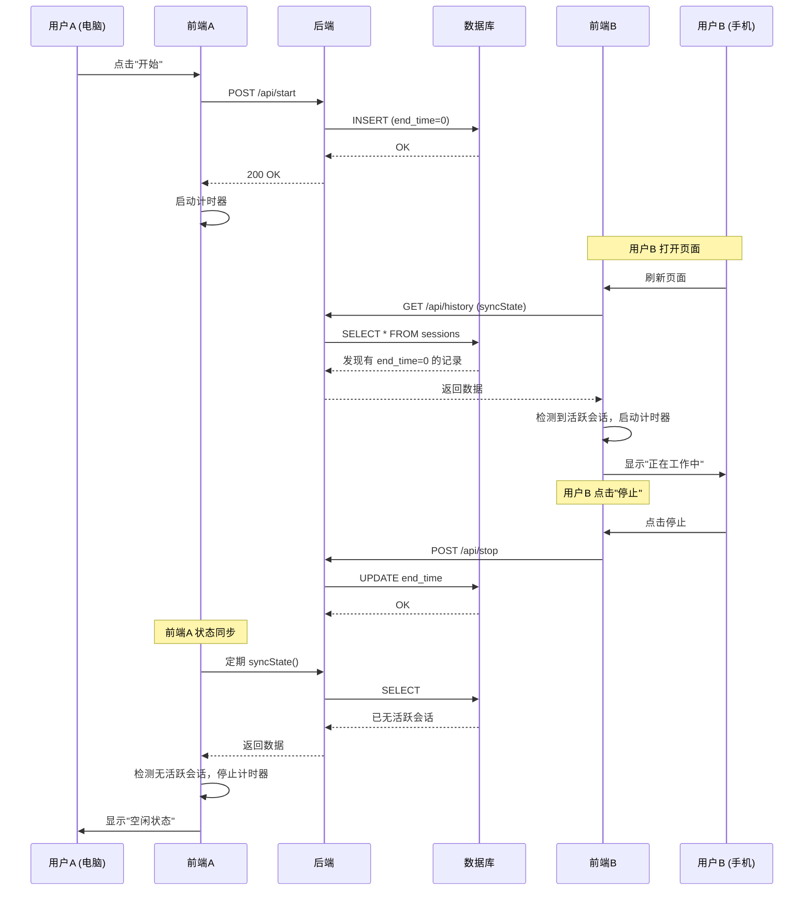
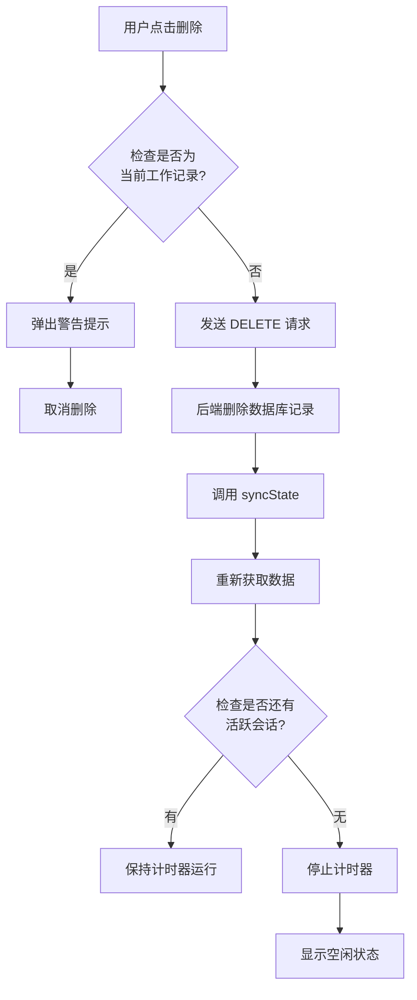
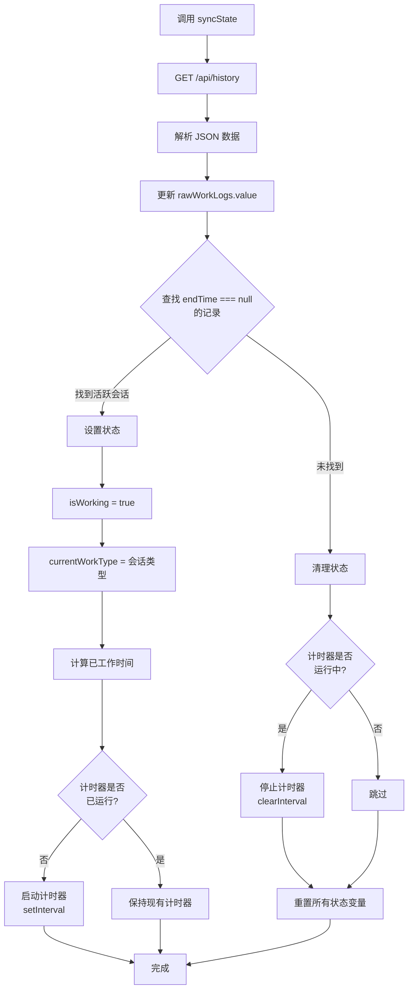
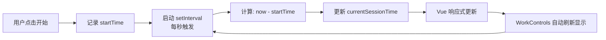
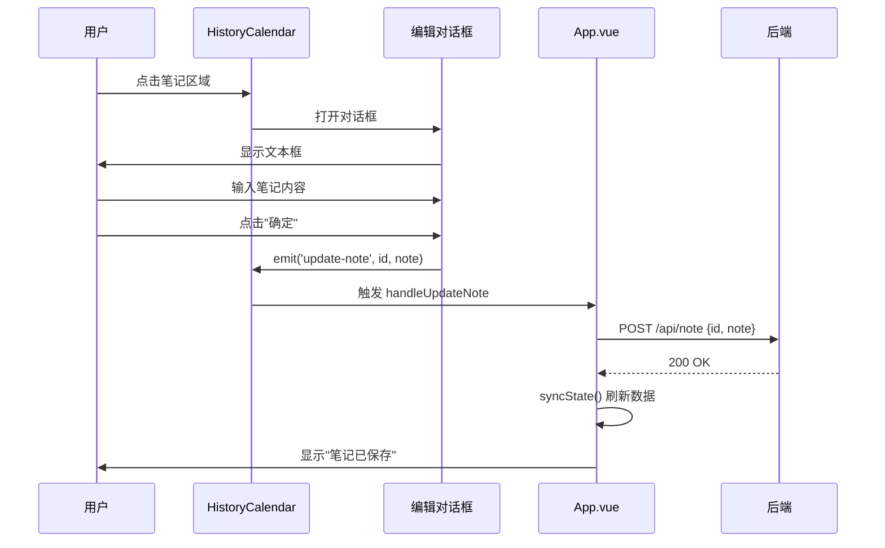
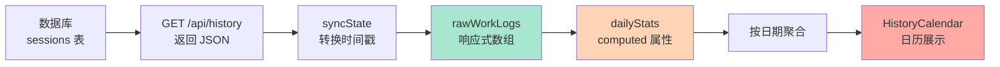

# 数据流图

## 1. 开始工作

```mermaid
sequenceDiagram
    participant U as 用户
    participant F as 前端(App.vue)
    participant B as 后端(WebServer)
    participant D as 数据库(SQLite)
    
    U->>F: 点击"开始工作"按钮
    F->>B: POST /api/start {type: "formal"}
    B->>D: INSERT INTO sessions (start_time, end_time=0, type)
    D-->>B: 成功
    B-->>F: 200 OK
    F->>F: 启动计时器 (setInterval)
    F->>B: GET /api/history (syncState)
    B->>D: SELECT * FROM sessions
    D-->>B: 返回所有记录
    B-->>F: JSON 数据
    F->>F: 更新 rawWorkLogs
    F->>U: 显示计时中...
```

## 2. 停止工作

```mermaid
sequenceDiagram
    participant U as 用户
    participant F as 前端
    participant B as 后端
    participant D as 数据库
    
    U->>F: 点击"结束"按钮
    F->>B: POST /api/stop
    B->>D: UPDATE sessions SET end_time=NOW() WHERE end_time=0
    D-->>B: 成功
    B-->>F: 200 OK
    F->>F: 停止计时器 (clearInterval)
    F->>B: GET /api/history (syncState)
    B->>D: SELECT * FROM sessions
    D-->>B: 返回数据
    B-->>F: JSON 数据
    F->>U: 显示"记录已保存"
```

## 3. 多端同步流程

```mermaid
sequenceDiagram
    participant UA as 用户A (电脑)
    participant FA as 前端A
    participant B as 后端
    participant D as 数据库
    participant FB as 前端B
    participant UB as 用户B (手机)
    
    UA->>FA: 点击"开始"
    FA->>B: POST /api/start
    B->>D: INSERT (end_time=0)
    D-->>B: OK
    B-->>FA: 200 OK
    FA->>FA: 启动计时器
    
    Note over UB,FB: 用户B 打开页面
    UB->>FB: 刷新页面
    FB->>B: GET /api/history (syncState)
    B->>D: SELECT * FROM sessions
    D-->>B: 发现有 end_time=0 的记录
    B-->>FB: 返回数据
    FB->>FB: 检测到活跃会话，启动计时器
    FB->>UB: 显示"正在工作中"
    
    Note over FB: 用户B 点击"停止"
    UB->>FB: 点击停止
    FB->>B: POST /api/stop
    B->>D: UPDATE end_time
    D-->>B: OK
    
    Note over FA: 前端A 状态同步
    FA->>B: 定期 syncState()
    B->>D: SELECT
    D-->>B: 已无活跃会话
    B-->>FA: 返回数据
    FA->>FA: 检测无活跃会话，停止计时器
    FA->>UA: 显示"空闲状态"
```

## 4. 删除记录流程（带保护）

```mermaid
flowchart TD
    A[用户点击删除] --> B{检查是否为<br/>当前工作记录?}
    B -->|是| C[弹出警告提示]
    C --> D[取消删除]
    B -->|否| E[发送 DELETE 请求]
    E --> F[后端删除数据库记录]
    F --> G[调用 syncState]
    G --> H[重新获取数据]
    H --> I{检查是否还有<br/>活跃会话?}
    I -->|有| J[保持计时器运行]
    I -->|无| K[停止计时器]
    K --> L[显示空闲状态]
```

## 5. 状态同步 (syncState) 核心逻辑

```mermaid
flowchart TD
    Start[调用 syncState] --> Fetch[GET /api/history]
    Fetch --> Parse[解析 JSON 数据]
    Parse --> Update[更新 rawWorkLogs.value]
    Update --> Check{查找 endTime === null<br/>的记录}
    
    Check -->|找到活跃会话| Active[设置状态]
    Active --> SetWorking[isWorking = true]
    SetWorking --> SetType[currentWorkType = 会话类型]
    SetType --> CalcTime[计算已工作时间]
    CalcTime --> CheckTimer{计时器是否<br/>已运行?}
    CheckTimer -->|否| StartTimer[启动计时器<br/>setInterval]
    CheckTimer -->|是| KeepTimer[保持现有计时器]
    StartTimer --> End[完成]
    KeepTimer --> End
    
    Check -->|未找到| Inactive[清理状态]
    Inactive --> StopTimer{计时器是否<br/>运行中?}
    StopTimer -->|是| Clear[停止计时器<br/>clearInterval]
    StopTimer -->|否| Skip[跳过]
    Clear --> Reset[重置所有状态变量]
    Skip --> Reset
    Reset --> End
```

## 6. 前端计时器工作原理

```mermaid
graph LR
    A[用户点击开始] --> B[记录 startTime]
    B --> C[启动 setInterval<br/>每秒触发]
    C --> D[计算: now - startTime]
    D --> E[更新 currentSessionTime]
    E --> F[Vue 响应式更新]
    F --> G[WorkControls 自动刷新显示]
    G --> C
```

## 7. 笔记编辑流程

```mermaid
sequenceDiagram
    participant U as 用户
    participant Cal as HistoryCalendar
    participant Dialog as 编辑对话框
    participant App as App.vue
    participant B as 后端
    
    U->>Cal: 点击笔记区域
    Cal->>Dialog: 打开对话框
    Dialog->>U: 显示文本框
    U->>Dialog: 输入笔记内容
    U->>Dialog: 点击"确定"
    Dialog->>Cal: emit('update-note', id, note)
    Cal->>App: 触发 handleUpdateNote
    App->>B: POST /api/note {id, note}
    B-->>App: 200 OK
    App->>App: syncState() 刷新数据
    App->>U: 显示"笔记已保存"
```

## 8. 数据处理管道

```mermaid
flowchart LR
    A[数据库<br/>sessions 表] --> B[GET /api/history<br/>返回 JSON]
    B --> C[syncState<br/>转换时间戳]
    C --> D[rawWorkLogs<br/>响应式数组]
    D --> E[dailyStats<br/>computed 属性]
    E --> F[按日期聚合]
    F --> G[HistoryCalendar<br/>日历展示]
    
    style D fill:#a8e6cf
    style E fill:#ffd3b6
    style G fill:#ffaaa5
```

