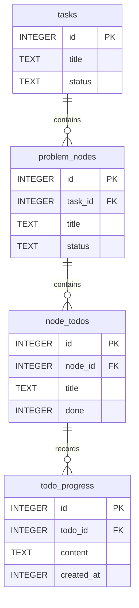

# 数据库说明

[返回 README](../README.md) · [系统架构](architecture.md) · [数据流](data-flow.md) · [API](api.md)

表结构、初始化和 SQL 实现在 [backend/include/db.hpp](../backend/include/db.hpp)。默认使用 `data/worktimer.db`，实际位置由配置中的 `database_path` 决定。本文描述当前代码的表和约束，不要求手工执行建表语句。

## 1. 数据关系



图中仅列关系相关的部分字段，完整字段见下文。一个任务可以没有节点，一个节点可以没有待办，一个待办可以没有日志；每个子对象必须有且只有一个对应父对象。

`sessions` 保存计时记录，与上述四张表没有关联。旧表 `node_progress` 仅用于历史迁移，不属于当前日志读写链路，见第 6 节。

## 2. 公共约定

- 所有表的 `id` 均为 `INTEGER PRIMARY KEY AUTOINCREMENT`，由 SQLite 分配；删除后不重新编号。
- 时间戳为服务器 Unix 秒，API 也使用秒；前端构造 JavaScript `Date` 时转换为毫秒。
- `created_at` 创建后保持不变；任务/节点的 `updated_at` 仅在该对象自身创建或更新时写入。新增子对象、勾选待办或追加日志不会更新上级时间。
- 表中的 `NOT NULL`、`CHECK`、外键与 HTTP 层校验各有作用：例如非空白标题和文本长度主要由 API 校验，不能把它们误当作 SQLite 自身的限制。

## 3. 计时表 sessions

| 字段 | SQLite 类型与约束 | 含义 |
| --- | --- | --- |
| `id` | INTEGER，主键自增 | 计时记录 ID |
| `start_time` | INTEGER，NOT NULL | 开始时间 |
| `end_time` | INTEGER，可为 NULL | 新记录写入 0 表示进行中；历史 NULL 同样视为进行中 |
| `type` | TEXT，NOT NULL | API 只接受 `formal` / `informal`；表本身没有枚举 CHECK |
| `note` | TEXT，默认空字符串，可为 NULL | 笔记；旧库缺此列时启动自动补列 |

查询用 `COALESCE(end_time,0)` 统一空值，API 返回的活跃记录 `end_time` 为 0。结束时间等于开始时间是一条合法的零秒记录。数据库没有持续累加的时长字段，时长由起止时间计算。

“同时最多一条活跃记录”由 `startSession()` 的条件插入实现，不是唯一索引。`stopSession()` 检查指定 ID 仍在进行中，以及开始时间 ≤ 结束时间 ≤ 服务器当前时间；`deleteSession()` 拒绝删除活跃记录。不要把直接写入 SQLite 等同于通过这些方法更新。

## 4. 任务面板的四张表

### tasks

| 字段 | 类型与约束 | 含义 |
| --- | --- | --- |
| `id` | INTEGER，主键自增 | 任务 ID |
| `title` | TEXT，NOT NULL | 标题 |
| `description` | TEXT，NOT NULL，默认 `''` | 说明 |
| `note_location` | TEXT，NOT NULL，默认 `''` | 笔记位置原文，不引用或读取文件 |
| `status` | TEXT，NOT NULL，默认 `todo`；CHECK 枚举 | `todo`、`doing`、`done` |
| `created_at` | INTEGER，NOT NULL | 创建时间 |
| `updated_at` | INTEGER，NOT NULL | 最近一次任务自身更新的时间 |

### problem_nodes

| 字段 | 类型与约束 | 含义 |
| --- | --- | --- |
| `id` | INTEGER，主键自增 | 节点 ID |
| `task_id` | INTEGER，NOT NULL，FK → `tasks.id` | 所属任务，删除任务时级联删除 |
| `title` | TEXT，NOT NULL | 问题标题 |
| `description` | TEXT，NOT NULL，默认 `''` | 问题说明 |
| `note_location` | TEXT，NOT NULL，默认 `''` | 笔记位置原文 |
| `status` | TEXT，NOT NULL，默认 `open`；CHECK 枚举 | `open`、`doing`、`resolved` |
| `created_at` | INTEGER，NOT NULL | 创建时间 |
| `updated_at` | INTEGER，NOT NULL | 最近一次节点自身更新的时间 |

没有 `parent_node_id` 字段，节点不能递归嵌套。

### node_todos

| 字段 | 类型与约束 | 含义 |
| --- | --- | --- |
| `id` | INTEGER，主键自增 | 待办 ID |
| `node_id` | INTEGER，NOT NULL，FK → `problem_nodes.id` | 所属节点，删除节点时级联删除 |
| `title` | TEXT，NOT NULL | 待办标题 |
| `done` | INTEGER，NOT NULL，默认 0；CHECK 为 0 或 1 | 未完成/完成；API 转为 JSON 布尔值 |
| `note_location` | TEXT，NOT NULL，默认 `''` | 笔记位置原文 |

当前待办表没有创建/更新时间列。完成比例由前端根据 `done` 计算，不单独存入数据库。

### todo_progress

| 字段 | 类型与约束 | 含义 |
| --- | --- | --- |
| `id` | INTEGER，主键自增 | 日志 ID |
| `todo_id` | INTEGER，NOT NULL，FK → `node_todos.id` | 所属待办，删除待办时级联删除 |
| `content` | TEXT，NOT NULL | 进度正文 |
| `created_at` | INTEGER，NOT NULL | 服务端保存时间；迁移的旧日志保留原时间 |

此表没有 `node_id`。面板查询通过连接 `node_todos` 得到节点归属，再在 API 响应中附加 `node_id`，供前端筛选。不能根据响应字段直接推断表结构。

```sql
SELECT p.id, t.node_id, p.todo_id, p.content, p.created_at
FROM todo_progress p
JOIN node_todos t ON t.id = p.todo_id
ORDER BY p.id DESC;
```

## 5. 索引、删除与一致性

| 索引 | 对应列 | 用途 |
| --- | --- | --- |
| `nodes_task` | `problem_nodes(task_id)` | 按任务查找/删除子节点 |
| `todos_node` | `node_todos(node_id)` | 按节点查找/删除待办 |
| `progress_todo` | `todo_progress(todo_id)` | 按待办查找/删除日志 |
| `progress_node` | `node_progress(node_id)` | 保留的旧表索引 |

数据库连接执行 `PRAGMA foreign_keys = ON`。任务、节点、待办之间的外键均设置 `ON DELETE CASCADE`，删除父对象会继续删除下属记录；勾选完成仅更新 `done`，不会删除日志。

Crow 可以多线程处理请求，单个 `Database` 对象用互斥锁串行执行其公开业务方法；预编译语句通过参数绑定接收用户文本。`sqlite3_busy_timeout` 为 5000 ms，用于等待数据库锁。互斥锁只保护同一进程中的对象，不是跨进程编辑锁；没有基于版本号的并发编辑冲突检测。

`getBoard()` 在该互斥锁内依次查询四类数据，阻止同一个服务的写方法插入查询之间，但没有额外包裹读事务。因此 API 所称的“面板快照”不代表对其他进程直接写库也提供跨表事务快照。

## 6. 初始化与迁移

构造 `Database` 时先创建目录、打开文件、启用外键，再检查并创建原有表和索引。`sessions` 缺少 `note` 列时，使用 `ALTER TABLE` 补齐。

原来的节点日志表结构为：

| 字段 | 类型与约束 |
| --- | --- |
| `id` | INTEGER，主键自增 |
| `node_id` | INTEGER，NOT NULL，FK → `problem_nodes.id`，ON DELETE CASCADE |
| `content` | TEXT，NOT NULL |
| `created_at` | INTEGER，NOT NULL |

随后 `migrateProgressToTodos()` 在 `BEGIN IMMEDIATE` 事务中检查 `PRAGMA user_version`。当版本小于 1 时：

1. 创建 `todo_progress` 及其索引。
2. 对每个有旧 `node_progress` 日志的节点，新建未完成的“历史进度（原节点记录）”待办。
3. 将该节点旧日志复制到新待办，保留日志 ID、正文和时间。
4. 将 `user_version` 设为 1 并提交；失败则回滚本次迁移事务。

空数据库会得到相同的新表，但不会生成历史待办。已有待办不会被改写；重启不会重复复制日志，删除已迁移日志后也不会重新出现。此前创建表和补 `note` 列的初始化步骤不在这个迁移事务内。

随后 `migrateNoteLocations()` 在独立的 `BEGIN IMMEDIATE` 事务中检查版本；版本小于 2 时，为 `tasks`、`problem_nodes`、`node_todos` 各新增 `note_location TEXT NOT NULL DEFAULT ''`，将 `user_version` 设为 **2** 后提交。失败回滚本次事务，重启可重试。现有记录得到空字符串，标题、说明、完成状态、日志和时间均保持原样。

新库和版本 0 的旧库依次执行两次迁移；版本 1 只执行新增字段迁移；版本 2 启动时跳过两次迁移。字段由启动流程管理，无需手动改库。

`note_location` 保存位置文字，没有文件存储或路径解析。API 创建时省略该字段会写入空字符串；更新时省略会保留原值，显式 `""` 才清空。SQL 使用绑定参数与 `COALESCE(?,note_location)` 区分这两种情况，旧客户端和快捷勾选不会意外清空位置。

旧 `node_progress` 表保留，但当前 API 不再读写它。它仍有节点外键，删除对应节点/任务时旧表记录也会级联删除，因此它不是完整的数据库备份或可靠的版本回退机制。不要手工重置 `user_version` 来重复运行迁移。

升级时停止旧程序，保留数据库文件与路径，再启动新版本；需要保留升级前副本时，在进程停止后复制原文件。新旧程序同时对同一库写入不属于支持的迁移流程。

## 7. 与 API 的对应关系

HTTP 路由、参数和数据库方法的完整对照集中在 [API 参考](api.md#2-接口与数据库操作总览)。数据库字段描述只在本文维护；接口示例解释它们如何被转换或组合成 JSON。
